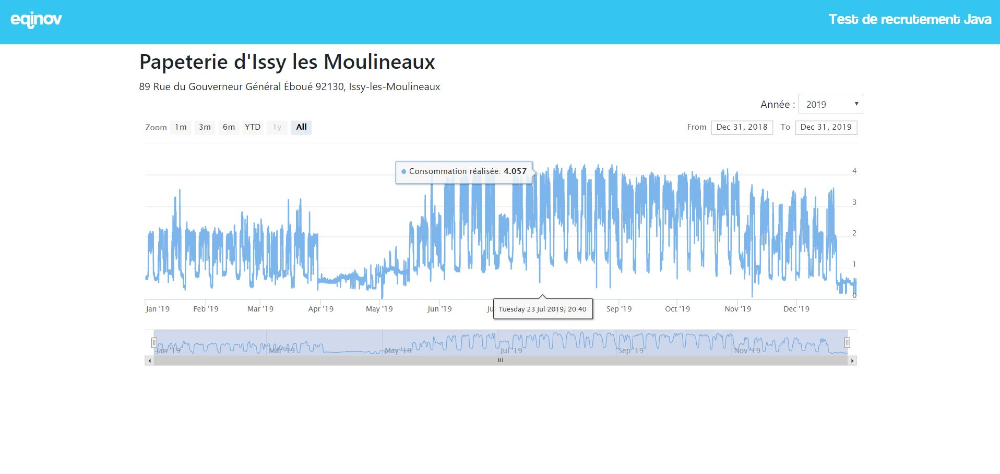

# Test de recrutement pour les développeurs Java

Bienvenue dans le projet de test de recrutement pour la société Eqinov. L'objectif est de tester vos compétences en développement Java sur un projet simplifié avec les différents frameworks que nous utilisons. 

## Pré-requis et installation
### Outils de build
Pour réaliser les développements demandés vous aurez besoin :

- de la version 8 du jdk
- d'un outil de gestion de dépendances et de compilation, le projet est configuré pour utiliser maven ou gradle. A Eqinov, nous utilisons gradle. Voici les liens d'installation, des deux outils :
 * maven : https://maven.apache.org/maven-release/download.cgi
 * gradle : https://gradle.org/releases/
 
### Vérification du build
Après avoir récupérer le projet sur github, vous pourrez vérifier que le projet fonctionne en tapant les commandes suivantes :

pour gradle
[indent=0]
----
	$ ./gradlew bootRun
----
 
pour maven
[indent=0]
----
	$ ./mvn spring-boot:run
----

Spring boot doit indiqué le démarrage du serveur dans la console. En tapant http://localhost:8080, vous accéderez à l'ihm web du projet.

### Outils pour modifier le projet
Pour modifier le code et débugguer le projet, vous aurez besoin :

- d'un environnement de développement eclipse ou intelij. A Eqinov, nous utilisons eclipse dont voici le lien d'installation : https://www.eclipse.org/downloads/packages/release/2019-12/r/eclipse-ide-enterprise-java-developers
- du serveur tomcat, nous utilisons la version 9 : https://tomcat.apache.org/download-90.cgi

Vous aurez par la suite besoin : 
- d'importer les sources du projet dans votre environnement de développement
- d'ajouter le serveur tomcat et d'ajouter le war eqinov-java-test au serveur tomcat (dans eclipse clic droit Add/remove)

Lorsque que vous êtes dans votre EDI, un fois le serveur lancé, vous accedez au projet dans votre navigateur en tapant http://localhost:8080/eqinov-java-test. Vous pouvez ainsi démarré/debuggué, votre projet pours les développements qui vont seront demandés.
